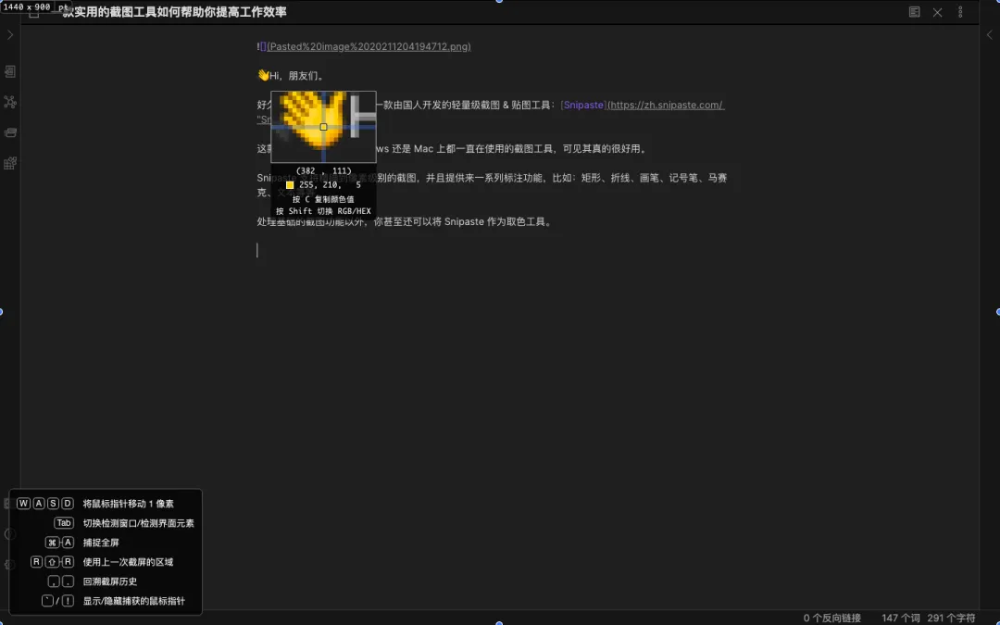

[Snipaste](https://zh.snipaste.com/) 这款工具是我不管在 Windows 还是 Mac 上都一直在使用的截图工具，可见其真的很好用。

Snipaste 支持精确到像素级别的截图，并且提供来一系列标注功能，比如：矩形、折线、画笔、记号笔、马赛克、文本等等。

Snipaste 截图可以自动检测识别界面元素区域，让截图更快，并且还有截图历史记录回放。

除了基础的截图功能以外，你甚至还可以将 Snipaste 作为取色工具、屏幕尺寸计算工具。

如上图所示是使用 Snipaste 截图时的工作页面，鼠标定位到的区域将会被放大，并且可以一键取色。

对于一般的截图工具来说，只管截图就完事了，但 Snipaste 独特的贴图功能才是其真正深得用户之心的原因。

使用 Snipaste 完成截图（快捷键：`F1`）之后，再按快捷键 `F3` 即可将刚刚的截图置顶贴在屏幕上。

Snipaste 的个人版本完全免费，安全且没有任何广告，使用起来也相当简单，但其实 Snipaste 也可以完成一些高级操作，官方为我们准备了详尽的 [用户手册](https://docs.snipaste.com/zh-cn/)。

总结：Snipaste 很简单也很强大，如果你之前没在用过一定要试试。